<p align="center">
  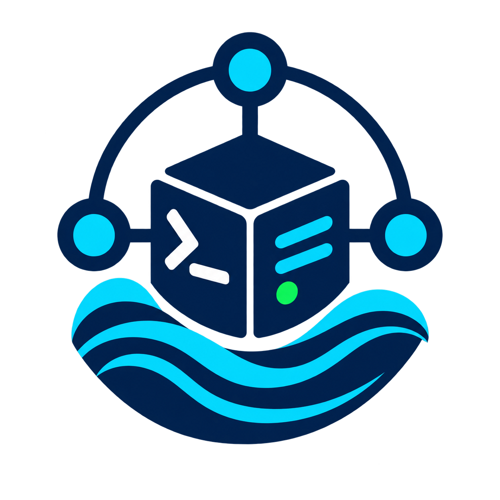
</p>

<h1 align="center">RemnaNode Manager</h1>

<p align="center">
  Один скрипт для установки и ежедневного администрирования Remnawave Node<br>
  на Ubuntu LTS и Debian stable. Ничего не нужно устанавливать — запускается одной командой.
</p>

> [!IMPORTANT]
> Скрипт запускается от `root`. Перед установкой рекомендуется иметь доступ к VPS-консоли провайдера на случай ошибки в DNS, firewall или сетевых настройках.

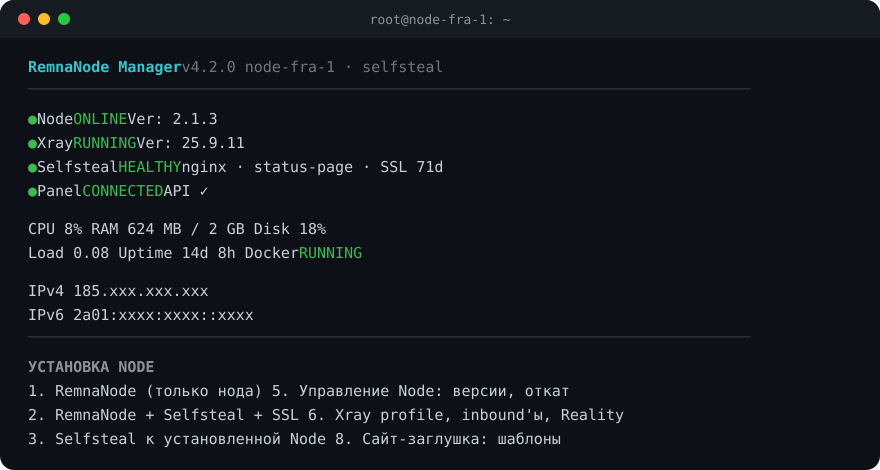

## Быстрый запуск

```bash
bash <(curl -Ls https://raw.githubusercontent.com/OverlayNode/Remnanode-manager/main/install.sh)
```

Запускается только `install.sh` — ядро: установка и управление нодой, Reality, профиль Xray, шапка и главное меню. Остальное вынесено в модули и подгружается при первом открытии соответствующего пункта меню:

| Модуль | Что внутри |
|---|---|
| [`sites`](modules/sites.sh) | сайты-заглушки: каталог шаблонов, уникализация |
| [`routing`](modules/routing.sh) | geo-файлы roscomvpn, DNS, политика РФ-трафика, клиентская маршрутизация |
| [`panel`](modules/panel.sh) | Remnawave Panel API |
| [`warp`](modules/warp.sh), [`psiphon`](modules/psiphon.sh), [`tor`](modules/tor.sh), [`zapret`](modules/zapret.sh) | внешние выходы и обход DPI |
| [`monitor`](modules/monitor.sh) | live-монитор, ресурсы, порты, логи, диагностика |
| [`admin`](modules/admin.sh) | UFW, BBR, swap, ping, fail2ban, обновления, бэкапы |

Модуль берётся из каталога `modules/` рядом со скриптом (клон репозитория), из `/usr/local/lib/remnanode/modules` (установленная команда) или скачивается из GitHub в `/run/remnanode-manager/modules`. Скачанный модуль проходит `bash -n` и должен совпадать по версии с ядром — иначе он не загружается. Шаблоны сайтов скачиваются только в момент выбора шаблона.

По желанию можно поставить команду `remnanode` вместе со всеми модулями, чтобы запускать меню без `curl` и без сети (меню → «Администрирование» → «Установить команду remnanode» или `install.sh install-command`). Повторный запуск этого пункта обновляет команду и модули.

### Более проверяемый способ

```bash
git clone https://github.com/OverlayNode/Remnanode-manager.git
cd Remnanode-manager
bash -n install.sh modules/*.sh
sudo ./install.sh
```

При запуске из клона модули и шаблоны берутся из локальных каталогов, без обращения к сети.

## Возможности

- **Установка Node** — три сценария:
  - только RemnaNode (Xray внутри ноды);
  - RemnaNode + Selfsteal + SSL;
  - Selfsteal для уже установленной Node (существующий Compose дополняется, а не перезаписывается).
- **Версия Node** — обновление, выбор тега с Docker Hub, откат на предыдущую версию по digest (работает даже с `latest`), закрепление версии.
- **Сайты-заглушки** — 12 готовых шаблонов; при каждом развёртывании сайт уникализируется.
- **Протоколы** — VLESS TCP (RAW) + Reality + Vision, VLESS XHTTP + Reality, Hysteria2: любой один или сразу все; 3–12 случайных shortIds, ротация ключей.
- **Routing** — roscomvpn geosite/geoip на ноде с ежедневным автообновлением; РФ и белые списки, блокировка торрентов, клиентская маршрутизация для Happ и шаблона подписки.
- **DNS** — раздельный: РФ-домены через РФ-резолверы, остальное через зарубежный DoH; перехват клиентского DNS на ноде — защита от утечек.
- **Модули** — WARP, Psiphon, Tor (с мостами obfs4/webtunnel/snowflake), Zapret2.
- **Мониторинг** — шапка со статусами и метриками, live-монитор, Docker, порты и подключения, логи, диагностика, тест скорости.
- **Администрирование** — UFW, BBR, swap, ping, fail2ban, обновление системы, очистка Docker, бэкапы.
- **Remnawave Panel API** — обновление Config Profile с diff и backup (режимы merge и full).

## Шапка

При каждом открытии меню показывается состояние сервера:

```text
 ● Node        ONLINE         Ver: 2.1.3
 ● Xray        RUNNING        Ver: 25.9.11
 ● Selfsteal   HEALTHY        nginx · status-page · SSL 71d
 ● Panel       CONNECTED      API ✓

 CPU   8%        RAM  624 MB / 2 GB        Disk 18%
 Load  0.08      Uptime 14d 8h             Docker RUNNING

 IPv4  185.xxx.xxx.xxx
 IPv6  — нет
```

| Строка | Как определяется |
|---|---|
| Node | `ONLINE` — контейнер запущен, Node API слушает порт и Xray работает; `WAITING` — API поднят, Panel ещё не прислала конфиг; `DEGRADED`, `OFFLINE` |
| Xray | процесс `xray` / `rw-core`; версия — из бинарника в контейнере |
| Selfsteal | healthcheck `nginx-selfsteal` и наличие `/dev/shm/nginx.sock`, текущий шаблон, дни до конца сертификата |
| Panel | `CONNECTED` — есть соединение Panel → Node или Xray получил конфиг; `API ✓/✗` — если сохранён API-токен |
| IPv4/IPv6 | публичные адреса интерфейсов; за NAT — внешний адрес (кешируется на час) |

## Сценарии установки

| Пункт меню | Что делает |
|---|---|
| 1. RemnaNode | Docker, Compose, UFW, контейнер `remnanode`. Inbound'ы настраиваются в Panel |
| 2. RemnaNode + Selfsteal + SSL | + домен, сертификат Let's Encrypt (acme.sh), `nginx-selfsteal` на `/dev/shm/nginx.sock`, сайт-заглушка, Xray-профиль с RAW / XHTTP / Hysteria2 |
| 3. Selfsteal к установленной Node | находит Compose существующей ноды и безопасно дополняет его через PyYAML (с backup и `docker compose config`) |

После установки можно подключить roscomvpn geo-файлы — скрипт предложит это сам.

### Протоколы

При установке Selfsteal (и в меню «Xray profile» → «Настроить inbound'ы заново») можно выбрать один протокол или любую комбинацию: `1`, `1,3`, `2,3`, `1,2,3`.

| # | Протокол | Порт по умолчанию | Маскировка |
|---|---|---|---|
| 1 | VLESS TCP (RAW) + REALITY + Vision | `443/tcp` | Reality → собственный Selfsteal-сайт |
| 2 | VLESS XHTTP + REALITY | `8443/tcp` (или `443`, если RAW не выбран) | Reality → собственный Selfsteal-сайт, случайный path |
| 3 | Hysteria2 | `443/udp` | TLS-сертификат домена ноды |

TCP и UDP `443` используются одновременно без конфликта. Flow `xtls-rprx-vision` назначается пользователям в Panel только для RAW, не для XHTTP. Ноде без Selfsteal (пункт 1) inbound'ы задаются в Panel: для Reality и Hysteria2 нужны домен и сертификат, которые настраивает Selfsteal.

### Версия Node

Меню «Управление Node»:

- **обновить** — `pull` текущего тега; digest прежнего образа сохраняется для отката;
- **выбрать версию** — список тегов `remnawave/node` с Docker Hub;
- **откатиться** — возврат на сохранённый digest; если после смены версии нода не поднялась, откат предлагается автоматически;
- **закрепить** — образ фиксируется по digest, обновления перестают его менять.

## Шаблоны сайтов-заглушек

Шаблоны лежат в [`templates/sites`](templates/sites). Все сделаны на чистых HTML, CSS, JS и SVG, без внешних CDN и шрифтов, и совместимы со строгим CSP nginx (без inline-скриптов и стилей, без форм и полей паролей).

| | | |
|---|---|---|
| **cloud-gateway**<br>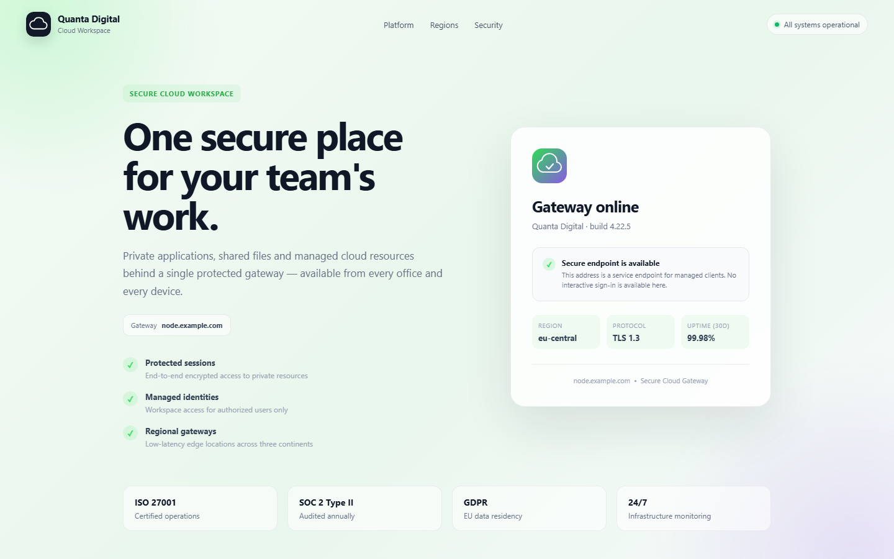 | **status-page**<br>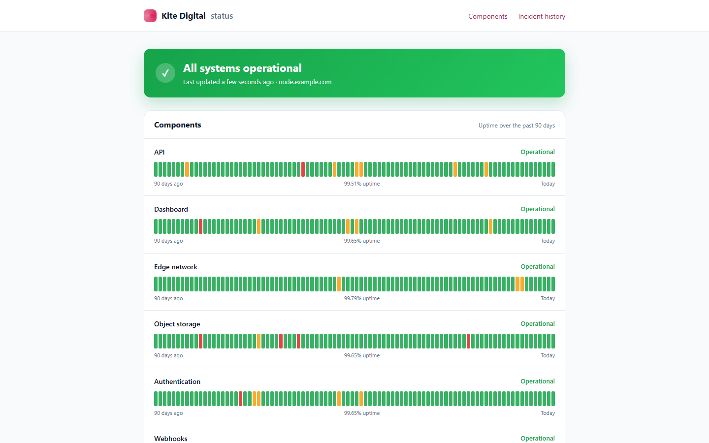 | **dev-docs**<br>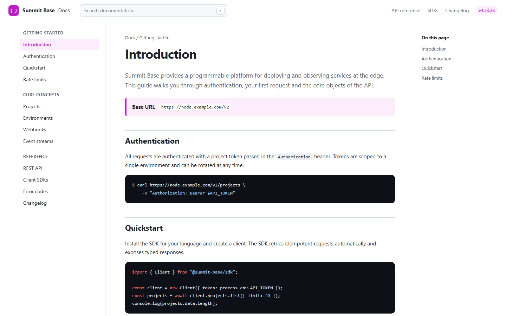 |
| **file-transfer**<br>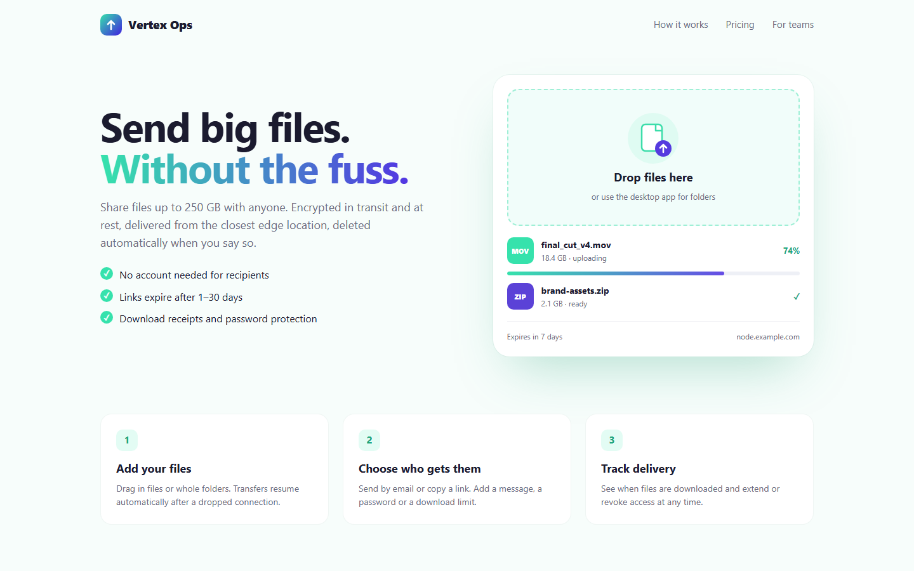 | **cdn-edge**<br>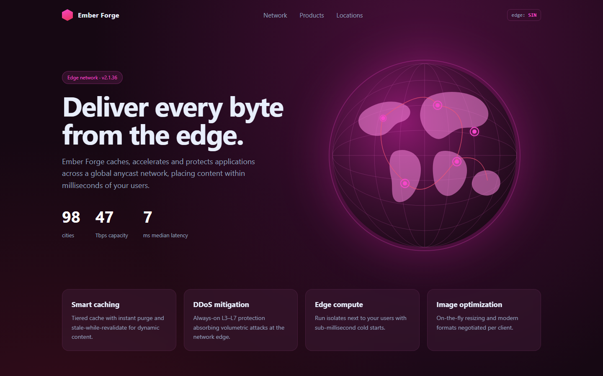 | **analytics-saas**<br>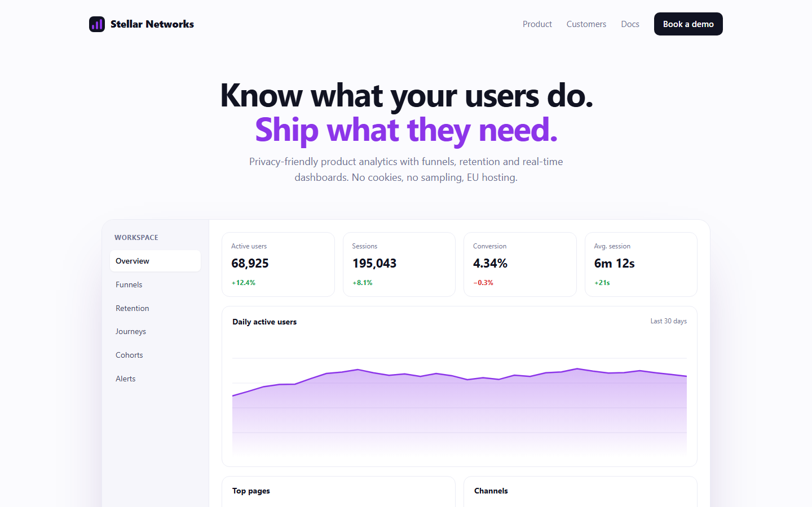 |
| **photo-studio**<br> | **game-studio**<br>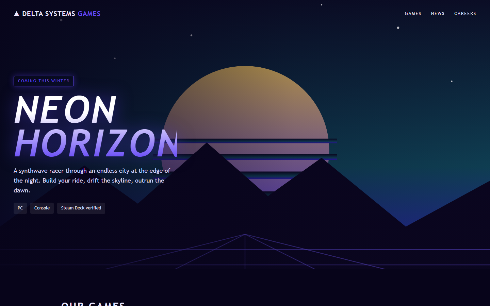 | **unit-converter**<br>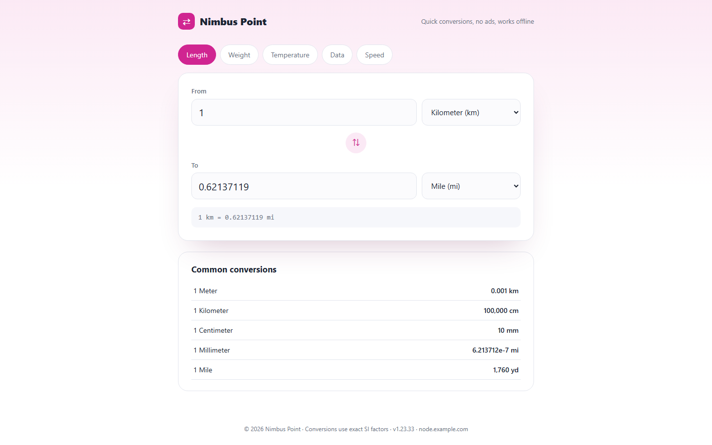 |
| **net-diagnostics**<br>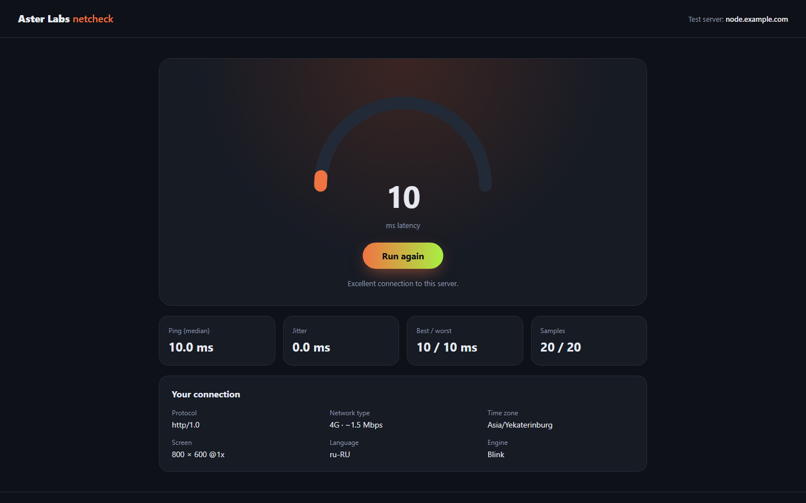 | **maintenance**<br>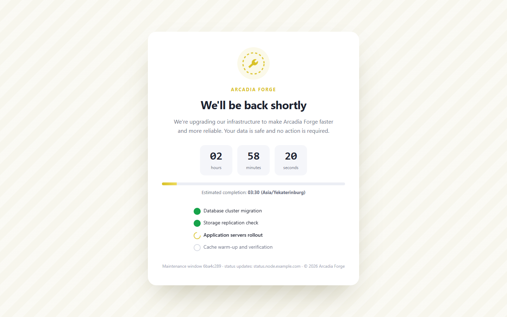 | **tech-blog**<br>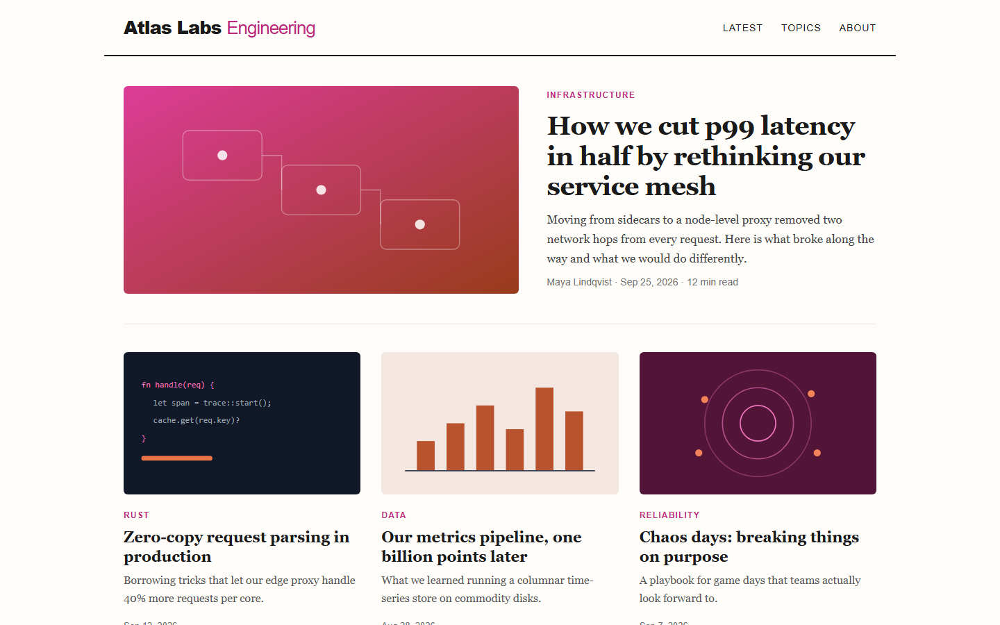 |

Скриншоты сделаны с одним из случайных вариантов: цвет и бренд на сервере будут другими.

### Уникальный отпечаток

Даже один и тот же шаблон при каждом развёртывании и при каждой перегенерации (меню «Сайт-заглушка» → «Перегенерировать») отличается:

- случайный префикс всех CSS-классов (`xq-banner`, `pks-banner`, …);
- случайный каталог ресурсов и имена файлов (`/static/7a01cf/524db1fe.css`, `/dist/974da2/…`);
- случайный оттенок палитры, бренд, версия, build-метки;
- случайное число бессмысленных, но валидных CSS-правил, дополнения в JS, атрибуты `<body>`;
- случайная минификация HTML;
- собственный favicon.

В итоге у HTML, CSS и JS каждый раз другие SHA-256, размеры и структура. Предыдущие 5 версий сайта хранятся в `backups/`, откат — одним пунктом меню.

Бренд можно задать постоянный или оставить случайным при каждом развёртывании.

## Routing

Целевая схема: **РФ-сайты и белые списки — напрямую, торренты — блок, всё остальное — через прокси.**

### Где что настраивается

| Уровень | Что делает | Где |
|---|---|---|
| **Клиент** | Решает, что идёт в VPN, а что напрямую. Только здесь «РФ → напрямую» действительно работает: трафик к РФ-сайтам не покидает страну и идёт с IP пользователя | Happ-маршрутизация или Xray JSON-шаблон подписки в Remnawave |
| **Нода** (Config Profile в Panel) | Страховка: что делать, если такой трафик всё же пришёл на ноду. Торренты блокируются всегда | Config Profile, который скрипт генерирует и может отправить в Panel |
| **Файлы на ноде** | geosite/geoip roscomvpn для `ext:`-правил | `/opt/remnanode/geo`, монтируются в контейнер по одному файлу |

По умолчанию РФ-трафик, пришедший на ноду, **блокируется**: так клиенты с неправильной маршрутизацией не светят зарубежный IP ноды перед российскими сервисами. Политику можно сменить на `direct` или `warp` (меню «Routing»).

### Правила профиля ноды (по порядку)

0. Запросы собственного DNS-резолвера Xray → DIRECT; клиентский DNS (порт 53) → перехват `dns-out`
1. `geoip:private`, `geosite:private` → BLOCK
2. BitTorrent (протокол + трекеры из roscomvpn) → BLOCK
3. Реклама и телеметрия → BLOCK (опционально)
4. Домены модулей → TOR / PSIPHON / WARP
5. `category-ru`, `whitelist`, `geoip:direct`, `geoip:whitelist` → политика RU (по умолчанию BLOCK)
6. Всё остальное → DIRECT (выход ноды)

> [!WARNING]
> Если включены geo-файлы roscomvpn, профиль содержит `ext:roscom-geosite.dat:…`. Xray не запустится на ноде без этих файлов — включи geo на **всех** нодах, которые используют этот Config Profile. Без geo-файлов скрипт автоматически использует встроенные `geosite:category-ru` / `geoip:ru`.

### DNS и защита от утечек

Меню «Routing» → «DNS».

| Запрос | Резолвер по умолчанию | Как защищён |
|---|---|---|
| РФ-домены (`category-ru`, `whitelist`, `.ru` / `.su` / `.рф`) | Яндекс `77.88.8.8`, `77.88.8.1` | ответ принимается, только если IP российский (`expectIPs`), иначе запрос уходит к зарубежному DNS |
| Все остальные | DoH Cloudflare + Google | зашифрован — ни провайдер ноды, ни ТСПУ не видят имён |
| DNS клиентов внутри туннеля (порт 53) | перехватывается на ноде | обрабатывается той же split-схемой вместо резолвера, который указал клиент |

Резолверы меняются в меню: для РФ — Яндекс (UDP или DoH) или свой список; для остальных — Cloudflare, Google, Quad9 или свой список. Запросы самого резолвера Xray всегда идут напрямую — иначе запрос к Яндекс-DNS попал бы под `geoip:ru → BLOCK`.

### Как РФ-сайты и приложения не увидят VPN

Одной ноды для этого недостаточно — нужны три условия, и скрипт готовит всё для каждого:

1. **РФ-трафик идёт с клиента напрямую** — с домашнего IP, а не через зарубежную ноду. Это клиентская маршрутизация (ниже). Нода по умолчанию блокирует пришедший к ней РФ-трафик, чтобы ошибка в настройках клиента не засветила её IP.
2. **РФ-домены резолвятся РФ-DNS напрямую, остальные — через DoH в туннеле.** Так РФ-сервисы получают «домашние» ответы, а зарубежные DNS-запросы не уходят мимо VPN.
3. **РФ-приложения исключены из VPN целиком** (раздельное туннелирование по приложениям в Happ / v2rayNG). На Android и iOS приложение видит сам факт VPN-интерфейса независимо от маршрутизации — единственная защита от этого — не пускать его в VPN. Скрипт формирует список популярных РФ-приложений (`profiles/client-ru-apps.txt`); проверь названия пакетов в своём клиенте.

### Клиентская маршрутизация

Меню «Routing» → «Клиентская маршрутизация»:

- ссылка `happ://routing/onadd/…` и JSON для Happ: РФ + whitelist напрямую с РФ-DoH, остальное через прокси с зарубежным DoH, торренты в блок, geo-файлы roscomvpn;
- `routing.rules` и `dns` для Xray JSON-шаблона подписки Remnawave (теги `proxy` / `direct` / `block`);
- список РФ-приложений для исключения из VPN.

Сгенерированные профили ноды и клиентский DNS-блок проверены `xray run -test` (Xray-core 26.3).

## Модули

| Модуль | Источник | Как подключается | Примечание |
|---|---|---|---|
| **WARP** | [Chara-Freedom/vps-warp](https://github.com/Chara-Freedom/vps-warp) | outbound `WARP`: `freedom` + `sockopt.interface: warp` | default route ОС не меняется; домены — в `routing/warp.list` |
| **Psiphon** | [Chara-Freedom/vps-psiphon](https://github.com/Chara-Freedom/vps-psiphon) | outbound `PSIPHON`: SOCKS5 `127.0.0.1:1080`, только TCP | ставится с `--bind-loopback`; не использовать как выход из страны с DPI |
| **Tor** | пакет `tor` | outbound `TOR`: SOCKS5 `127.0.0.1:9050` | мосты obfs4 / webtunnel / snowflake для серверов в РФ; `.onion` → Tor |
| **Zapret2** | [bol-van/zapret2](https://github.com/bol-van/zapret2) | обработка исходящего трафика сервера (nfqws2) | архив релиза сверяется с `sha256sum.txt`; интерактивный `install_easy.sh`, `blockcheck2` для подбора стратегии |

Сторонние установщики WARP и Psiphon скачиваются во временный файл и проходят `bash -n`. Перед запуском скрипт показывает URL и SHA-256 и ждёт подтверждения.

## Remnawave Panel API

Меню «Remnawave Panel API»:

1. Сохранить URL панели и API-токен (`/opt/remnanode/panel.env`, `0600`).
2. Выбрать Config Profile.
3. Отправить профиль:
   - **merge** — inbound'ы панели остаются, заменяются `outbounds`, `routing`, `dns` (подходит для любой ноды);
   - **full** — профиль заменяется целиком (для Selfsteal-нод со сгенерированными inbound'ами).

Перед отправкой текущий профиль сохраняется в `backups/` и показывается diff (приватные ключи скрыты). Используются `GET /api/config-profiles`, `GET /api/config-profiles/{uuid}` и `PATCH /api/config-profiles`.

Токен не обязателен: без него статус Panel в шапке определяется по связи панели с нодой.

## Мониторинг и администрирование

- **Live-монитор** — шапка, топ процессов, `docker stats`, подключения по inbound'ам с числом уникальных IP; обновление каждые 3 с.
- **Сервер подробно** — ОС, CPU, RAM, swap, диски, сеть, трафик интерфейсов, BBR, NTP.
- **Порты** — слушающие сокеты, нагрузка по inbound'ам, топ-10 IP.
- **Логи** — RemnaNode (в том числе в реальном времени), nginx, журнал скрипта, системные ошибки, UFW, WARP / Psiphon / Tor.
- **Диагностика** — Docker, контейнеры, firewall, geo-файлы, модули, DNS, сертификаты, TLS через Reality fallback, проверка профиля в Xray ноды.
- **Администрирование** — UFW (открыть или закрыть порт, разрешить IP), BBR, swap, ответы на ping, fail2ban для SSH, `apt upgrade`, очистка Docker, перезагрузка.
- **Бэкапы** — архив `/opt/remnanode` (без кеша и старых бэкапов) и восстановление.

## Команды

```bash
install.sh                  # интерактивное меню
install.sh status           # только шапка
install.sh install-command  # установить команду remnanode
install.sh geo-update       # обновить geo-файлы roscomvpn
install.sh site-refresh     # перегенерировать сайт с новым отпечатком
install.sh profile          # пересобрать Xray profile
```

## Файлы и каталоги

```text
/opt/remnanode/
├── docker-compose.yml          Compose ноды (0600)
├── installer.conf              состояние скрипта
├── reality.env                 Reality keys и shortIds (0600)
├── panel.env                   URL и токен Panel API (0600)
├── nginx.conf                  конфигурация Selfsteal
├── ssl/                        сертификат и ключ
├── html/                       текущий сайт-заглушка
├── geo/                        roscom-geosite.dat, roscom-geoip.dat
├── routing/                    warp.list, psiphon.list, tor.list
├── profiles/                   xray-profile.json, profile-info.txt, клиентские routing / DNS / приложения
├── backups/                    бэкапы, копии сайта, профили из Panel
└── .cache/                     кеш каталога шаблонов
/usr/local/bin/remnanode               команда (после install-command)
/usr/local/lib/remnanode/modules/      модули установленной команды
/run/remnanode-manager/modules/        кеш скачанных модулей (до перезагрузки)
/usr/local/sbin/remnanode-geo-update   ежедневное обновление geo (systemd timer)
/var/log/remnanode-manager.log         журнал
```

## Порты

| Порт / endpoint | Назначение | Публичный доступ |
|---|---|---|
| SSH (обычно `22/tcp`) | администрирование | нужен администратору |
| `2222/tcp` | RemnaNode API, подключение Panel → Node | желательно только с IP/CIDR Panel |
| `80/tcp` | ACME HTTP-01 | нужен для выпуска и продления сертификата |
| `443/tcp` | VLESS RAW + Reality | клиентам |
| `8443/tcp` | VLESS XHTTP + Reality | клиентам, если используется XHTTP |
| `443/udp` | Hysteria2 | клиентам, если используется Hysteria2 |
| `/dev/shm/nginx.sock` | Reality Selfsteal target | локальный UNIX socket |
| `127.0.0.1:1080` | Psiphon SOCKS | только локально |
| `127.0.0.1:9050` | Tor SOCKS | только локально |

## Внешние подключения

| Адрес | Когда |
|---|---|
| `raw.githubusercontent.com`, `codeload.github.com` | запуск скрипта, модули при первом открытии, каталог шаблонов, команда `remnanode` |
| `download.docker.com`, Docker Hub | установка Docker, образы, список тегов `remnawave/node` |
| `get.acme.sh`, Let's Encrypt | выпуск и продление сертификата |
| `github.com/hydraponique/roscomvpn-*` | geo-файлы (при включении и ежедневно) |
| `api.github.com/repos/bol-van/zapret2` | установка Zapret2 |
| DNS-резолверы из настроек (по умолчанию Яндекс, Cloudflare, Google) | резолв доменов Xray на ноде |
| URL вашей панели | только при настроенном Panel API |
| `api.ipify.org` | внешний IPv4, только если на интерфейсах нет публичного адреса |
| `speed.cloudflare.com`, `www.cloudflare.com/cdn-cgi/trace`, `check.torproject.org` | только по запросу: тест скорости и проверки модулей |

Скрипт не отправляет телеметрию.

## Разработка

```bash
bash -n install.sh modules/*.sh
bash tests/test_install.sh           # нужны jq и openssl
shellcheck -x install.sh modules/*.sh tests/*.sh tools/*.sh
bash tools/render-previews.sh        # пересобрать preview.png (Chrome/Chromium + python3)
```

Новый модуль — файл `modules/<name>.sh` со строкой `RNM_MODULE_VERSION="<версия ядра>"`; его имя добавляется в `RNM_MODULES`, а пункт меню вызывает `open_module_menu <name> <функция>`. При смене версии ядра обновляется маркер во всех модулях.

Новый шаблон — это каталог `templates/sites/<name>/` с файлами `index.html`, `404.html`, `manifest.json`, CSS/JS/SVG. В нём доступны плейсхолдеры:

| Плейсхолдер | Значение |
|---|---|
| `__P__` | префикс классов |
| `__BRAND__`, `__BRAND_SLUG__` | бренд |
| `__DOMAIN__` | домен ноды |
| `__HUE__`, `__HUE2__` | оттенки палитры |
| `__SEED__` | число для JS |
| `__VERSION__`, `__BUILD__` | версия и build-метка |
| `__YEAR__` | текущий год |

Ссылки на ресурсы должны быть абсолютными (`/style.css`, `/assets/x.svg`). Тесты проверяют, что после рендера не остаётся плейсхолдеров, inline-скриптов и стилей, форм, а все ссылки ведут на существующие файлы.

## Важные замечания

- Не публикуйте `installer.conf`, `reality.env`, `panel.env`, `docker-compose.yml` и бэкапы: там `SECRET_KEY`, приватные ключи и токены.
- Регенерация Reality keys или shortIds требует обновить клиентские конфигурации.
- Не назначайте один TCP-порт одновременно RAW и XHTTP.
- Firewall провайдера (security group) нужно настраивать отдельно.

## Решение проблем

### APT/dpkg занят unattended-upgrades

Сразу после запуска VPS на Ubuntu автоматическое обновление может удерживать `/var/lib/dpkg/lock-frontend`. Удалять lock-файл вручную нельзя. Скрипт ждёт освобождения APT до 600 секунд; таймаут можно изменить:

```bash
APT_LOCK_TIMEOUT=1200 bash <(curl -Ls https://raw.githubusercontent.com/OverlayNode/Remnanode-manager/main/install.sh)
```

### Xray не запускается после включения geo

Проверь, что на ноде есть файлы (меню «Мониторинг» → «Диагностика», раздел Routing / geo). Если профиль с `ext:`-правилами назначен ноде без geo-файлов, включи на ней geo или отправь в Panel профиль без них.
