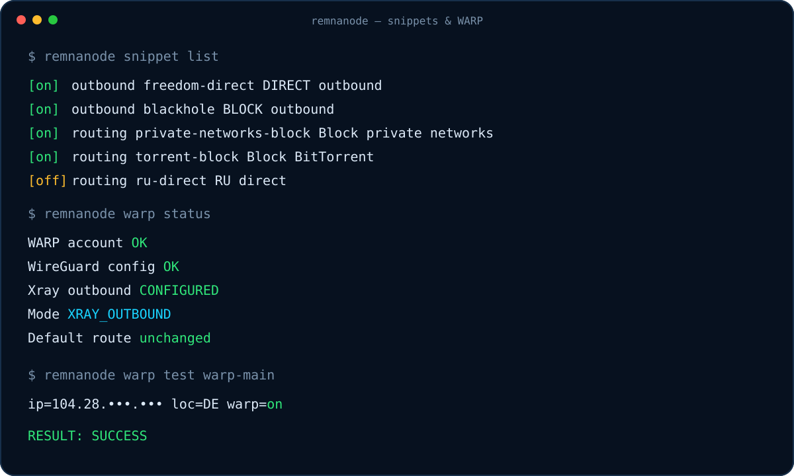

<p align="center">
  
</p>

<h1 align="center">RemnaNode Manager</h1>

<p align="center">
  Модульный CLI/TUI для установки и ежедневного администрирования Remnawave Node<br>
  на Ubuntu LTS и Debian stable.
</p>

> [!IMPORTANT]
> Менеджер предназначен для запуска от `root`. Перед установкой рекомендуется иметь доступ к VPS-консоли провайдера на случай ошибки в DNS, firewall или сетевых настройках.


## Возможности

- интерактивный dashboard и CLI с `--json` и `--dry-run`;
- состояния Node `ONLINE`, `DEGRADED`, `OFFLINE`, `UPDATING`, `UNKNOWN`;
- метрики CPU, RAM, swap, disk, load average и uptime;
- определение версий Docker, Compose, RemnaNode и Xray;
- фильтрация private, loopback, link-local и ULA-адресов;
- управление lifecycle Node и Xray, выбор версии и rollback;
- Reality keys через `xray x25519` и 3–12 уникальных random shortIds;
- Config Profile generator с JSON/Xray validation;
- snippet manager с dependencies, conflict detection и safe merge;
- WARP как Xray WireGuard outbound без изменения default route ОС;
- отдельные Tor outbound и routing snippets;
- Selfsteal, SSL, UFW, datasets, backups и systemd timers;
- интеграция с документированными Remnawave Panel API endpoints;
- atomic apply: `diff → validate → backup → replace → healthcheck → rollback`;
- tmux-сессия `remnanode-manager`, переживающая разрыв SSH.

## Быстрый запуск

Войдите под `root`:

```bash
sudo -i
```

Затем запустите интерактивный установщик:

```bash
bash <(curl -Ls https://raw.githubusercontent.com/OverlayNode/Remnanode-manager/main/install.sh)
```

В меню можно установить Node или выбрать пункт `13` для установки/обновления модульной команды `remnanode`.

Для установки только модульного manager без открытия меню:

```bash
bash <(curl -Ls https://raw.githubusercontent.com/OverlayNode/Remnanode-manager/main/install.sh) install-manager
```

> [!CAUTION]
> Однострочная команда выполняет текущий `install.sh` из ветки `main`, поэтому используйте её только если доверяете репозиторию. Для аудита и фиксации конкретной версии предпочтительнее способ через `git clone`/release tag ниже. При установке модульной части bootstrap дополнительно проверяет структуру скачанного архива и выполняет `bash -n` до копирования файлов.

### Более проверяемый способ

Если важно сначала изучить код:

```bash
git clone https://github.com/OverlayNode/Remnanode-manager.git
cd Remnanode-manager
bash -n install.sh remnanode lib/*.sh
sudo ./install.sh install-manager
```

После установки:

```bash
remnanode status
remnanode
```

## Что устанавливается

Manager использует стандартные системные компоненты:

- Docker Engine и Docker Compose plugin;
- `curl`, `jq`, `openssl`, `tmux`;
- `ufw`, `iproute2`, `dnsutils`;
- `python3-minimal` и `python3-yaml` для безопасной работы с Compose YAML;
- `acme.sh` при настройке сертификата;
- Nginx container для Selfsteal;
- опционально `wgcf`/WARP и Tor.

Основные каталоги:

```text
/opt/remnanode-manager/          код manager
/usr/local/bin/remnanode         глобальная команда
/opt/remnanode/                  Compose и конфигурация Node
/opt/remnanode/manager-state/    snippets, WARP, datasets и состояние
/opt/remnanode/generated/        profile.json, reality.json, routing.json
/opt/remnanode/backups/          timestamped backups
/opt/remnanode/ssl/              сертификат и приватный ключ
/etc/remnanode-manager/          защищённые настройки интеграций
/var/log/remnanode-manager.log   журнал manager
```

Конфигурации с ключами и tokens создаются с ограниченными правами `0600`/`0700`.

## Порты

Значения ниже — defaults. RAW, XHTTP, Hysteria2 и Node API можно изменить во время настройки.

| Порт / endpoint | Направление | Назначение | Публичный доступ |
|---|---|---|---|
| текущий SSH-порт, обычно `22/tcp` | inbound | администрирование сервера | нужен администратору |
| `2222/tcp` | inbound | RemnaNode API, подключение Panel к Node | желательно только с IP/CIDR Panel |
| `80/tcp` | inbound | ACME HTTP-01 challenge | нужен для выпуска/renew сертификата |
| `443/tcp` | inbound | VLESS RAW + Reality по умолчанию | нужен клиентам |
| `8443/tcp` | inbound | VLESS XHTTP + Reality, если RAW уже занимает `443/tcp` | нужен клиентам при использовании XHTTP |
| `443/udp` | inbound | Hysteria2 по умолчанию | нужен клиентам при использовании Hysteria2 |
| `/dev/shm/nginx.sock` | локальный UNIX socket | Reality Selfsteal target | в интернет не публикуется |
| `127.0.0.1:9050` | local only | Tor SOCKS outbound | в интернет не публикуется |
| `127.0.0.1:19090` | temporary local only | WARP healthcheck SOCKS probe | создаётся только на время теста |

TCP и UDP `443` могут использоваться одновременно, поскольку это разные transport protocols.

### Рекомендации для firewall

- сначала разрешается текущий SSH-порт, затем применяются остальные правила;
- `2222/tcp` рекомендуется разрешать только от IP или CIDR Remnawave Panel;
- не открывайте `9050` и `19090` наружу;
- при cloud firewall/security group откройте те же inbound-порты вручную;
- не включайте UFW по SSH без доступа к rescue/VPS console;
- выбранные порты проверяются на конфликт до изменения конфигурации.

Пример минимальных inbound rules для RAW:

```text
SSH_PORT/tcp   trusted administrator networks
2222/tcp      Remnawave Panel IP/CIDR only
80/tcp        0.0.0.0/0 and ::/0 for ACME HTTP-01
443/tcp       0.0.0.0/0 and ::/0 for clients
```

## Какие внешние подключения выполняются

| Адрес/сервис | Протокол | Когда используется |
|---|---|---|
| `raw.githubusercontent.com` | HTTPS `443/tcp` | загрузка bootstrap `install.sh` |
| `codeload.github.com` | HTTPS `443/tcp` | загрузка полного архива manager |
| `download.docker.com` | HTTPS `443/tcp` | Docker repository и GPG key |
| Docker registry | HTTPS `443/tcp` | загрузка образов RemnaNode/Nginx |
| `get.acme.sh` и ACME CA | HTTPS `443/tcp` | установка ACME client, выпуск и renew TLS |
| настроенный Remnawave Panel URL | HTTP/HTTPS, обычно `443/tcp` | health, Nodes и Config Profiles API |
| системные DNS resolvers | UDP/TCP `53` | DNS lookup и диагностика |
| `1.1.1.1`, `1.0.0.1` | DNS `53` | встроенный Cloudflare DNS snippet |
| URL пользовательского dataset | HTTPS `443/tcp` | загрузка дополнительных `.dat` файлов |
| Cloudflare WARP endpoint | WireGuard/UDP, порт из `wgcf-profile.conf` | только трафик, направленный в WARP outbound |
| `www.cloudflare.com/cdn-cgi/trace` | HTTPS через временный SOCKS/Xray | реальная проверка WARP egress |
| Tor network | исходящие Tor connections | только после явной установки Tor |

Manager не отправляет telemetry и не использует внешний AI API для генерации Selfsteal-сайтов.

## Как устроено подключение Node

```text
Remnawave Panel
      │
      │ TCP 2222 (желательно allowlist Panel IP)
      ▼
  RemnaNode container
      │
      ├── Xray inbound: RAW / XHTTP / Hysteria2
      ├── UNIX socket /dev/shm/nginx.sock → Nginx Selfsteal
      └── Xray routing → DIRECT / BLOCK / WARP / Tor
```

WARP по умолчанию не влияет на SSH, Docker, DNS операционной системы, package repositories и соединение Node → Panel:

```text
Client → Xray inbound → routing rule → WARP outbound
Server default route ─────────────────→ unchanged
```



## DNS и домен

Для Selfsteal и TLS необходим домен:

- `A` должен указывать на публичный IPv4 Node;
- если существует `AAAA`, он должен указывать на публичный IPv6 этой же Node;
- TCP `80` должен быть доступен снаружи для HTTP-01;
- DNS proxy/CDN может мешать проверке — на время первичного выпуска сертификата может потребоваться режим DNS-only;
- после смены IP обновите DNS до renew сертификата.

## Reality shortIds и ключи

Автоматический режим использует `openssl rand`:

- случайное количество: 3–12;
- длина каждого ID независимо выбирается из `2, 4, 6, 8, 10, 12, 14, 16`;
- только lowercase hexadecimal;
- дубли исключаются;
- обычный update не меняет keys или shortIds.

При миграции старый одиночный `RAW_SHORT_ID`/`XHTTP_SHORT_ID` сохраняется первым элементом, поэтому существующие клиенты продолжают работать. Полная регенерация требует отдельной команды и подтверждения.

```bash
remnanode reality shortids list
remnanode reality shortids regenerate
```

> [!WARNING]
> Регенерация Reality keys или удаление старых shortIds требует обновить клиентские конфигурации.

## WARP и Tor

`remnanode warp install` создаёт WireGuard credentials и Xray outbound snippet. Команда не выполняет `wg-quick up`, не создаёт системный default route через WARP и не смешивает установку с routing rules.

```bash
remnanode warp install warp-main
remnanode warp outbound warp-streaming
remnanode warp status --json
remnanode warp test warp-main
```

Tor также разделён:

```bash
remnanode tor install       # устанавливает runtime
remnanode tor outbound      # создаёт outbound snippet
remnanode tor routing       # отдельно создаёт .onion rule
```

## Panel API

Credentials хранятся в `/etc/remnanode-manager/panel.env` с mode `0600`:

```bash
PANEL_URL=https://panel.example.com
PANEL_TOKEN=...
```

```bash
remnanode panel configure https://panel.example.com
remnanode panel test
remnanode panel profiles
remnanode panel nodes
```

Используются только подтверждённые endpoints `/api/system/health`, `/api/config-profiles` и `/api/nodes`. Перед update существующего профиля manager скачивает текущую версию, сохраняет backup и показывает diff.

## Основные CLI-команды

```bash
remnanode status [--json]
remnanode doctor --export /tmp/remnanode-doctor.txt

remnanode node status|start|stop|restart|update
remnanode node select-version 3.4.0
remnanode node rollback
remnanode xray status|version|restart|validate|logs

remnanode config generate|print|view|copy|edit|apply
remnanode snippet list|show|enable|disable|validate|merge
remnanode routing list
remnanode routing dataset add NAME.dat URL [SHA256]
remnanode firewall ping status
remnanode firewall ping disable
remnanode firewall ping enable

remnanode backup create
remnanode backup list
remnanode backup restore BACKUP
remnanode schedule install|status
```

Глобальные flags можно ставить в любом месте команды:

- `--json` — machine-readable output для поддерживаемых команд;
- `--dry-run` — preview без применения изменений;
- `--yes` — подтверждать допустимые automation prompts.

## Отключение ping

Manager может отключить ответы сервера на ICMP Echo для IPv4 и IPv6:

```bash
remnanode firewall ping status
remnanode firewall ping disable
remnanode firewall ping enable
```

Настройка сохраняется в `/etc/sysctl.d/99-remnanode-ping.conf`, поддерживает `--dry-run`, показывает diff и создаёт backup существующего managed-файла.

Отключаются только ответы на Echo Request. ICMP/ICMPv6 целиком не блокируется: сообщения об ошибках, IPv6 Neighbor Discovery и Path MTU Discovery продолжают работать.

> [!NOTE]
> После отключения ping обычные внешние uptime-проверки по ICMP будут считать сервер недоступным. Используйте TCP/HTTPS healthcheck Node или Panel.

## Backup и безопасность изменений

Перед опасными изменениями создаются backups в `/opt/remnanode/backups/YYYY-MM-DD_HH-MM-SS-*`.

Для конфигураций применяется последовательность:

```text
candidate.new
  → JSON / Compose / Xray validation
  → preview diff
  → backup
  → atomic replace
  → restart/reload
  → healthcheck
  → rollback on failure
```

Diagnostic export очищает tokens, passwords, authorization headers, cookies, private keys и UUID.

## Обновления по расписанию

`remnanode schedule install` создаёт systemd timers для:

- backup;
- healthcheck/doctor;
- dataset update;
- manager update status check;
- ACME certificate renewal.

Проверить расписание:

```bash
remnanode schedule status
systemctl list-timers 'remnanode-*'
```

## Проверка проекта

```bash
bash -n install.sh remnanode lib/*.sh
bash tests/test_install.sh
bash tests/test_manager.sh
shellcheck install.sh remnanode lib/*.sh tests/*.sh
```

Тесты manager требуют `jq` и `openssl`.

## Важные замечания

- Не публикуйте `installer.conf`, `reality.json`, `panel.env`, WARP credentials, backups и generated profiles.
- Не удаляйте старые Reality credentials до миграции всех клиентов.
- Не назначайте один TCP-порт одновременно RAW и XHTTP.
- Перед update Node сохраните рабочую версию image tag.
- Не включайте system-wide WARP на удалённом сервере без out-of-band console.
- Проверяйте `remnanode doctor` после изменений DNS, TLS, firewall или routing.
- Репозиторий не заменяет firewall/security group VPS-провайдера.

## Решение проблем

### APT/dpkg занят unattended-upgrades

На Ubuntu сразу после запуска VPS автоматическое обновление может удерживать `/var/lib/dpkg/lock-frontend`. Удалять lock-файл вручную нельзя: это может повредить состояние package manager.

Installer автоматически ждёт освобождения APT/dpkg до 600 секунд. Таймаут можно изменить:

```bash
APT_LOCK_TIMEOUT=1200 bash <(curl -Ls https://raw.githubusercontent.com/OverlayNode/Remnanode-manager/main/install.sh) install-manager
```

Если обновление длится дольше таймаута, дождитесь его завершения и безопасно запустите ту же команду повторно. Проверить владельца lock можно так:

```bash
ps -fp "$(fuser /var/lib/dpkg/lock-frontend 2>/dev/null)"
systemctl status unattended-upgrades --no-pager
```
